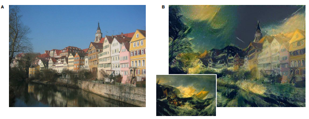
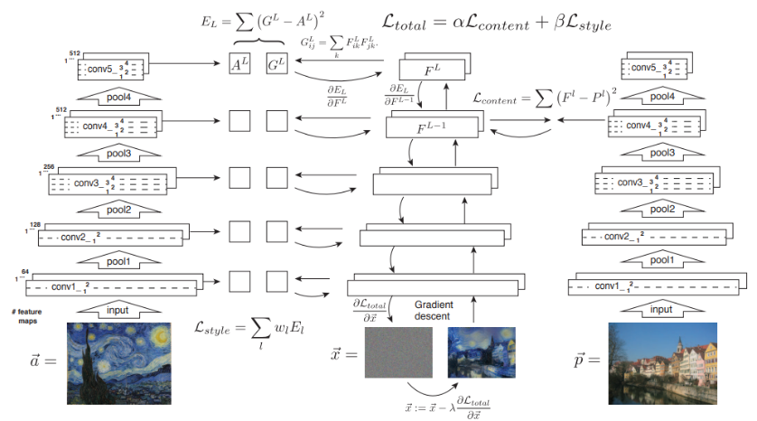

# Style Transfer
## 1. Introduction
우선 예시를 보자.

    

왼쪽이 원래 이미지(input), 오른쪽의 작은 이미지가 스타일을 추출할 이미지, 그리고 오른쪽 큰 이미지가 변환된
 인풋 이미지다. Style Transfer 는 말그대로 이미지의 스타일을 변환시키는 것이다. 저자는 base가 되는 CNN의
 모델은 VGG를 사용했고 content image와 style image을 나눠 독립적으로 처리하는 방법을 보여주었다.

## 2. Content representation
이미지에서 우선 디테일한 픽셀의 정보는 지우고 high level content 만 보존하는 식으로 가는데 이는 아래의 그림처럼
 진행된다.
 

    

뒤로 갈수록 사진은 뭔가 일그러진것 처럼 보이지만 이미지에 있는 핵심 feature 들은 보존하고 있는 상태다. 
 세세한 부분은 모두 생략해버린 것이다. 즉 content image에 대해 전체적인 느낌을 살린 것이다.

## 3. style representation
style representation의 특징을 위해서 위의 content representaion 과정과 마찬가지로 이미지의 핵심 feature
 를 뒤로갈수록 보존시키고 앞쪽은 detail을 살리는 쪽이다.

    

## 4. style transfer

    

최종적인 모델의 목적은 두 이미지의 특징을 추려내 원본이미지에 스타일을 적용시켜 새로운 이미지를 만들어내는 것이다.
  α 와 β는 content 와 style의 weight를 얼마나 반영 할지에 대한 값이다. 결국 loss를 최소화 시키는 것이 이미지 생성의
 핵심이라 할 수 있다.

